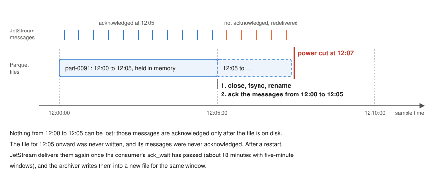

# Design notes

These notes explain why the system is built the way it is, for anyone changing
it. Each section states the choice, the reason, and what it costs.

## A NATS server on every edge node

Each edge node runs its own NATS server with JetStream, joined to central NATS
as a leaf node, instead of the services talking to central NATS directly.

The roadside network drops out. With a local server, the streamer always has
somewhere to publish, the archiver keeps reading from the local stream, and
recording carries on through an outage of any length. When the link comes
back, the live subjects flow to central again without anyone doing anything.
The leaf connection is opened from the box outward, so the box needs no public
address and no inbound firewall rule, and one connection carries both live data
and exports.

The cost is one more server per box to install and monitor, and a JetStream
store on the box's disk.

## Samples go through JetStream before they reach Parquet

The streamer never writes files. It publishes to a JetStream stream, and the
archiver consumes from it.

This separates the part that must never stall (reading the LabJack, whose
buffer overflows if it is not read in time) from the part that can (writing to
disk). It also gives the archiver something to retry from: a message stays in
the stream until the archiver acknowledges it, so an archiver crash or restart
loses nothing.

## Acknowledge only after the file is on disk

The archiver holds each window's samples in memory and writes the whole file
when the window ends. It closes the file, syncs it and its folder to disk,
renames it from `.parquet.inprogress` to `.parquet`, and only then acknowledges
the messages it came from.

An earlier version acknowledged each message as soon as it was buffered. A
crash then lost up to five minutes per channel, because the half-written file
had no Parquet footer and the messages were already marked done. Acknowledging
after the file is durable closes that gap: the worst a crash can do is delay
the samples until JetStream delivers them again.

Two settings on the consumer make this work. `ack_wait` (18 minutes with
five-minute files) must be longer than a window plus the idle timeout, or
JetStream would redeliver messages that are only waiting for their file to
close. `max_ack_pending` (50,000) must be larger than the messages in one
window. As a safety net, the archiver closes a file early if 20,000 messages
are waiting, so the consumer can never stall on its limit whatever the sample
rate.

The cost is memory, one window of samples and messages per channel (roughly 10
to 20 MB at 2 kHz), and a rare duplicate: if the process dies after a file is
renamed but before the acknowledgements are sent, those samples are written
again into a second file for the same window.

This protects data between JetStream and Parquet. JetStream itself writes to
disk on its own schedule (every two minutes with its default settings), so an
abrupt power cut can still lose up to that much of the most recent data before
it reaches the archiver.

## Files cover aligned windows of sample time

A file covers `:00` to `:05`, `:05` to `:10` and so on, measured by the
samples' own timestamps rather than the clock on the wall.

Aligned windows make files line up across channels and boxes, so finding the
data for a moment means opening one predictable file per channel. Using sample
time rather than wall-clock time keeps the layout right when the archiver
catches up on a backlog: an hour of stored messages consumed in a minute still
produces twelve five-minute files, not one.

An earlier version rotated on a wall-clock timer and on sample time at the
same time. The two raced, and every so often produced a file with a single
message in it. There is now one rule, and a separate timer that only closes a
file that has stopped receiving data.

## One row group per file, compressed

Each file is a single Parquet row group with zstd compression, delta-encoded
timestamps and dictionary-encoded values.

Timestamps rise by the same interval every sample, so delta encoding reduces
them to almost nothing. Values come from a 16-bit converter, so a channel uses
only a few hundred distinct values in five minutes, and a dictionary stores
each once. Measured on a real MU1 file at 2 kHz, this is 0.5 MB instead of
6.9 MB, about 14 times smaller, with exactly the same values. At 2 kHz on four
channels that is roughly 0.6 GB a day, so a 1 TB disk holds years of data.

Small row groups would not make anything safer. An unfinished file has no
footer and cannot be read either way; the safety comes from the
acknowledgements above.

## Timestamps come from the host clock

The LabJack streams samples at a fixed rate but does not timestamp them. The
streamer stamps the first read with the system clock and counts forward by the
sample interval.

Two clocks are involved, and they disagree. The LabJack's crystal and the
system clock drift apart by a few parts per million, which added up to 4 to 5
seconds over one 26-day run. The streamer now compares its timeline with the
system clock every 60 seconds. It uses the smallest difference seen in the
window, which removes jitter from read latency, and shifts the timeline when
the difference reaches 5 ms. Each shift is logged.

This makes the timestamps exactly as good as the system clock, which is why
the setup guide insists on a synchronized `chronyd`. A box with a broken NTP
configuration records correct samples with wrong times, and nothing else
notices.

## One source of truth for configuration

What to record lives in one document in the central key-value bucket. The
webapp edits it there, and each streamer mirrors its own key into the box's
local bucket and follows the local copy.

Central editing means no one logs in to a box to change a sample rate. The
local mirror means a box that restarts while central NATS is unreachable still
knows what to record. The box profile in the repository only seeds the first
copy; after that it is not read, which avoids two places disagreeing.

## Exports travel over NATS

The exporter subscribes to a request subject instead of serving HTTP. The
webapp already holds a NATS connection to central, and central already reaches
every box over its leaf link, so exports need no extra port, address or
tunnel. The subject contains the box's identity, so a request reaches exactly
one exporter.

Core NATS has no flow control, so the exporter waits for the client to
acknowledge every eight chunks. A slow connection then slows the export down
instead of dropping chunks.

The exporter reads only the row groups whose timestamp range overlaps the
request, reads the two columns directly rather than row by row, and formats
the date part of each timestamp once per second rather than once per row.
Together that made producing an export about three times faster; over the
network, where transfer time dominates, downloads finished about twice as fast.

## The streamer gives up after five failures

If the LabJack fails five times in a row, the streamer exits with a success
status, and systemd, which restarts only on failure, leaves it stopped.

A LabJack that is unplugged or unpowered will not come back by being retried
every few seconds for days, and the retries fill the journal. Stopping makes
the fault visible in `systemctl` and in the health metrics, and someone
restarts the service once the hardware is fixed.
