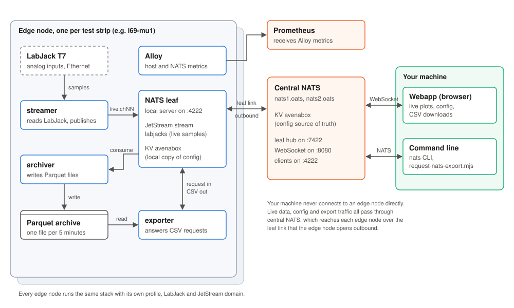

# Avena

Avena records sensor data from instrumented pavement test strips and makes it
available to people who are not standing next to the road. Each test strip has
an edge node: a small Fedora computer in a roadside box with a LabJack T7 data
acquisition device wired to the buried sensors. The edge node samples the
sensors, keeps a local archive, and connects out to a central NATS server so the
data can be watched live and downloaded from anywhere on the network.

This site covers the software in the
[avena-rs](https://github.com/oats-center/avena-rs) repository: the Rust
services that run on each edge node, the configuration that ties an edge node
to the central servers, and the webapp used to watch and export data.

## How the pieces fit together

An edge node runs four long-lived programs from this repository and one
monitoring agent:

| Program | What it does |
|---|---|
| `streamer` | Opens the LabJack over Ethernet, streams the enabled analog inputs, and publishes the samples to the local NATS server as small FlatBuffer batches, one subject per channel. |
| NATS leaf | A NATS server on the edge node itself. It stores the live samples in a JetStream stream, keeps a local copy of the configuration, and holds one outbound *leaf* connection to central NATS. |
| `archiver` | Reads the samples back out of JetStream and writes them to compressed Parquet files, one file per channel per five minutes. |
| `exporter` | Waits for export requests that arrive through central NATS, reads the matching Parquet files and streams them back as CSV. |
| Alloy | Collects host, NATS and service health metrics and sends them to central Prometheus. |

The central side is two NATS servers (`nats1.oats` and `nats2.oats`) and a
Prometheus server. Your machine talks only to central NATS: the webapp over
WebSocket, command-line tools over the normal NATS port.

## How data moves

**Live samples.** The streamer publishes each batch to a subject such as
`avenars.i69.i69-mu1.i69-lj2.live.ch11`. The leaf forwards it to central NATS,
and any browser plotting that channel receives it a moment later.

**Archive.** The same messages are kept in the edge node's JetStream stream. The
archiver consumes them and writes Parquet files. It acknowledges a message only
after the file holding its samples has been closed and synced to disk, so if the
power fails mid-file the messages are delivered again and nothing is lost.

**Configuration.** Which channels to record, how fast, and how to convert volts
to engineering units live in a JSON document in the central `avenabox` key-value
bucket. The webapp edits it there. Each streamer mirrors its own key into the
local bucket and restarts sampling when it changes. The local copy lets an edge
node keep recording through an outage of the central servers.

**Exports.** The webapp sends an export request to
`avenars.<site>.<box>.<source>.export.request`. Central NATS routes it over the
leaf link to the right edge node, where the exporter replies with CSV chunks.
The browser acknowledges the chunks as they arrive, which keeps a slow
connection from being flooded.

## Why it is built this way

Edge nodes sit on roadside networks that drop out, and they are hard to
reach physically. Three decisions follow from that.

The edge node dials out. The leaf connection is opened from the edge node to
central NATS, and live data and exports both travel over it. The streamer also
opens an ordinary client connection to central NATS to mirror its
configuration. Both connections are outbound, so the box needs no public
address and no inbound firewall rule.

Data is stored where it is measured. The Parquet archive stays on the edge
node, and only the live stream and requested exports cross the network. A long
outage delays remote access, but does not lose data.

Configuration has one source of truth. The central key-value bucket is
authoritative, and edge nodes hold a mirror. There is no configuration to edit
by hand on a box once it is installed.

## Repository layout

| Path | Contents |
|---|---|
| `rust-ljm/` | The Rust services: `streamer`, `archiver`, `exporter`, and the `subscriber` and `recompress` tools. |
| `webapp/` | The SvelteKit webapp for live plots, configuration and exports. |
| `shared/` | Edge node profiles, the renderer that turns a profile into service configuration, container and systemd unit files. |
| `scripts/` | Installer, status and health-metric scripts, the command-line export client, and the docs build. |
| `docs/` | This site. |

## Where to go next

- Setting up a new edge node: [Edge node setup](setup/edge-node-legacy.md).
- Checking on a running edge node: [Services on an edge node](operations/services.md).
- Working on the code: [API reference](code-api.md).
