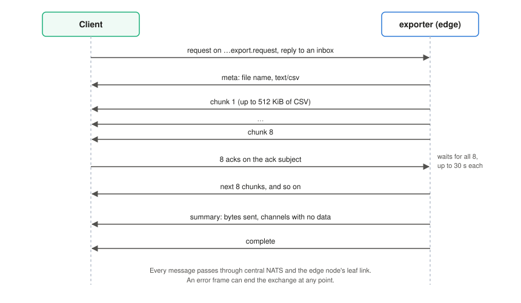

# Export protocol

The exporter on each edge node answers requests for archived data over NATS.
The webapp uses this protocol, and so does `scripts/request-nats-export.mjs`.
Anything that can publish and subscribe on NATS can use it.

[](../figures/export-sequence.svg)

## Request

Publish a JSON request to the box's request subject with a reply inbox:

```text
avenars.<site_id>.<box_id>.<source_id>.export.request
```

```json
{
  "asset": 1001,
  "channels": [8, 9, 10, 11],
  "start": "2026-09-22T12:00:00Z",
  "end": "2026-09-22T12:30:00Z",
  "format": "csv",
  "download_name": "mu1-noon.csv",
  "ack_subject": "_INBOX.abc123.acks"
}
```

| Field | Required | Meaning |
|---|---|---|
| `asset` | yes | Asset number, selecting `asset<NNN>/` in the archive. |
| `channels` | yes | Channel numbers to export. Duplicates are removed and the list is sorted. |
| `start`, `end` | yes | RFC 3339 times. Both ends are inclusive; `end` must not be before `start`. |
| `format` | no | `csv`, the default and the only format supported. |
| `download_name` | no | File name reported in the `meta` frame. Default `labjack_asset<NNN>_<start>_<end>.csv`. |
| `ack_subject` | no | Subject the client acknowledges chunks on. Strongly recommended; see below. |

## Replies

Replies go to the request's reply inbox. Each carries the header
`Avena-Export-Frame` naming its kind:

| Frame | Body | When |
|---|---|---|
| `meta` | `{"type":"meta","fileName":"…","contentType":"text/csv"}` | First, once the request is accepted |
| `chunk` | raw CSV bytes | One or more, each up to about 512 KiB |
| `summary` | `{"type":"summary","bytesSent":N,"missingChannels":[…]}` | After the last chunk |
| `complete` | `{"type":"complete"}` | Last |
| `error` | `{"type":"error","message":"…"}` | Instead of the rest, or after some chunks if reading fails |

`missingChannels` lists requested channels for which no rows fell in the
range. The first chunk always starts with the CSV header, so even an export
with no data returns one chunk.

## CSV

```text
timestamp,channel,raw_value,calibrated_value,calibration_id
2026-09-22T12:00:00.008+00:00,ch08,3.7219,252.34,tp3505
```

| Column | Meaning |
|---|---|
| `timestamp` | Sample time in RFC 3339, UTC |
| `channel` | `chNN` |
| `raw_value` | Volts, as recorded |
| `calibrated_value` | `raw_value` with the calibration stored in that sample's file |
| `calibration_id` | The calibration's `id`, or `identity` |

Rows come channel by channel, and within a channel in file order.

## Flow control

Core NATS delivers as fast as the exporter publishes, so a slow client would
fall behind and lose chunks. When the request has an `ack_subject`, the
exporter waits after every eight chunks until it has received eight messages
on that subject, allowing up to 30 seconds for each. The content of an ack
message is ignored. A client should publish one ack per chunk as it stores it.
Without `ack_subject`, the exporter sends as fast as it can.

## Errors

The exporter answers with an `error` frame, and nothing else, when the
request is not valid JSON, `channels` is empty, a time does not parse, `end` is
before `start`, or `format` is not `csv`. If a client gets no reply at all,
nothing is subscribed to the request subject: the exporter is not running or
the box is offline.

Requests are handled concurrently, each on its own task.
