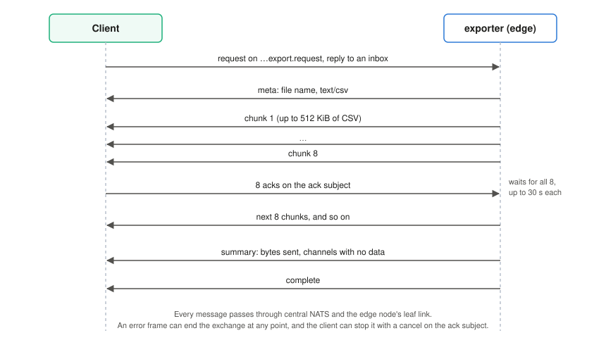

# Export protocol

The exporter on each edge node answers requests for archived data over NATS.
The webapp uses this protocol, and so does `scripts/request-nats-export.mjs`.
Anything that can publish and subscribe on NATS can use it.

[](../figures/export-sequence.svg)

## Request

Publish a JSON request to the box's request subject with a reply inbox:

```text
avenars.<site_id>.<box_id>.<source_id>.export.request
```

```json
{
  "asset": 1001,
  "channels": [8, 9, 10, 11],
  "start": "2026-09-22T12:00:00Z",
  "end": "2026-09-22T12:30:00Z",
  "format": "csv",
  "download_name": "mu1-noon.csv",
  "ack_subject": "_INBOX.abc123.acks"
}
```

| Field | Required | Meaning |
|---|---|---|
| `asset` | yes | Asset number, selecting `asset<NNN>/` in the archive. |
| `channels` | yes | Channel numbers to export. Duplicates are removed and the list is sorted. |
| `start`, `end` | yes | RFC 3339 times. Both ends are inclusive; `end` must not be before `start`. |
| `format` | no | `csv`, the default and the only format supported. |
| `download_name` | no | File name reported in the `meta` frame. Default `labjack_asset<NNN>_<start>_<end>.csv`. |
| `ack_subject` | no | Subject the client acknowledges chunks on. Strongly recommended; see below. |
| `filters` | no | Noise filters per channel, keyed by channel number as a string, in the shape of the config's `sensor_settings.filters` (see [LabJack configuration](kv-config.md#filters)). When a requested channel has any filter on, the CSV gets a `filtered_value` column; see [Filtered values](#filtered-values). |

## Replies

Replies go to the request's reply inbox. Each carries the header
`Avena-Export-Frame` naming its kind:

| Frame | Body | When |
|---|---|---|
| `meta` | `{"type":"meta","fileName":"…","contentType":"text/csv"}` | First, once the request is accepted |
| `chunk` | raw CSV bytes | One or more, each up to about 512 KiB |
| `summary` | `{"type":"summary","bytesSent":N,"missingChannels":[…]}` | After the last chunk |
| `complete` | `{"type":"complete"}` | Last |
| `error` | `{"type":"error","message":"…"}` | Instead of the rest, or after some chunks if reading fails |

`missingChannels` lists requested channels for which no rows fell in the
range. The first chunk always starts with the CSV header, so even an export
with no data returns one chunk.

## CSV

```text
timestamp,channel,raw_value,calibrated_value,calibration_id
2026-09-22T12:00:00.008+00:00,ch08,3.7219,252.34,tp3505
```

| Column | Meaning |
|---|---|
| `timestamp` | Sample time in RFC 3339, UTC |
| `channel` | `chNN` |
| `raw_value` | Volts, as recorded |
| `calibrated_value` | `raw_value` with the calibration stored in that sample's file |
| `calibration_id` | The calibration's `id` if it has one, otherwise its `type`: `identity`, `linear` or `polynomial` |

Rows come channel by channel, and within a channel in time order. If the
archive holds the same sample more than once (the same timestamp and raw
value, left by an archiver that was fed the same messages again), it is sent
once. Rows with the same timestamp but different values are all sent.

## Filtered values

The exporter does not read the box configuration, so a client that wants filtered
values sends the channels' filter settings in `filters`; the webapp copies them
from the configuration when "Include filtered values" is ticked:

```json
"filters": { "8": { "despike": true, "remove_10hz": true, "remove_11_9hz": true,
                    "highpass_hz": 1.0, "lowpass_hz": 100.0 } }
```

If no requested channel has a filter on (the field is missing, empty, not an
object, or every switch is off), the CSV is byte for byte the same as without
it. Otherwise the header and every row get a sixth column:

```text
timestamp,channel,raw_value,calibrated_value,calibration_id,filtered_value
2026-09-22T12:00:00.008+00:00,ch08,3.7219,252.34,tp3505,0.8127
```

| Column | Meaning |
|---|---|
| `filtered_value` | The sample after the channel's filters, in calibrated units. On a channel without filters it equals `calibrated_value`. Empty when it cannot be computed: a sample stored as `NaN`, or a row whose timestamp repeats or precedes the one before it. |

How it is computed, for each filtered channel:

- The exporter also reads 30 s before `start` (so the 10 Hz and 11.9 Hz templates
  have learnt the interference by the first row) and, after `end`, twenty time
  constants of the lowest cutoff (at least 1 s, at most 2 min) plus 0.1 s, so the
  backward pass has settled. Only rows in the requested range are sent.
- The sample interval is the median step of the first 32 rows of each stretch.
  Up to 4 missing samples are filled in as `NaN` and filtered through; a longer
  gap, a step off the sample grid or a new rate starts every filter again,
  templates included (after a gap the stream may be a new run with another
  phase).
- Despike and the templates run as in the live plot; the calibration stored with
  each row's file is applied next; the high-pass and low-pass filters run forward
  and then backward over each stretch (zero phase, −6 dB at the cutoff). Long
  stretches are processed in blocks of 65,536 samples, each backward pass
  starting from the settling margin past the block, so memory stays bounded.
- Filters that cannot run at the data's rate (see
  [LabJack configuration](kv-config.md#filters)) are skipped.

An exporter from before this field ignores it and sends the five plain columns.

## Flow control

Core NATS delivers as fast as the exporter publishes, so a slow client would
fall behind and lose chunks. When the request has an `ack_subject`, the
exporter waits after every eight chunks until it has received eight messages
on that subject, allowing up to 30 seconds for each. An ack is any message on
that subject other than a cancel (see below); an empty message is enough. A
client should publish one ack per chunk as it stores it. Without
`ack_subject`, the exporter sends as fast as it can.

## Cancel

To stop an export early, publish one cancel message on the same `ack_subject`:

```text
subject:  <ack_subject>
header:   Avena-Export-Frame: cancel
body:     {"type":"cancel"}
```

Either part is enough: the exporter treats a message as a cancel if it has
that header, or if its body is JSON with `"type":"cancel"` (for tools that
cannot set headers). Empty acks are never mistaken for a cancel.

The exporter reads its ack subject before publishing each chunk and while it
waits for acks, so it stops before the next chunk: chunks it had already
published may still arrive, and nothing is sent after it has read the cancel,
not even an `error` or `complete` frame. It then closes the ack subscription,
drops its file readers and logs
`[exporter] export cancelled by the client after N chunk(s), M bytes`.

The webapp sends a cancel when the user cancels an export, and also when it
gives up for another reason after sending the request (idle timeout, a frame it
cannot parse). It sends none after `complete`, after an `error` frame or after
a no-responders status.

Compatibility:

- A client that never sends a cancel works as before.
- An exporter that predates the cancel message counts it as one ack. It then
  waits for the remaining acks of the current round and stops after its
  30-second ack timeout, as it did before, having sent at most eight more
  chunks. A client should therefore unsubscribe from its reply inbox after
  cancelling instead of waiting for a final frame.

## Errors

The exporter answers with an `error` frame, and nothing else, when the
request is not valid JSON, `channels` is empty, a time does not parse, `end` is
before `start`, or `format` is not `csv`. If nothing is subscribed to the
request subject (the exporter is not running or the box is offline), the NATS
server answers the request's reply subject with a no-responders status message
(code 503) instead, provided the client connected with headers and no-responders
support, as nats.js does. The dashboard stops the export at once when it sees
it.

Requests are handled concurrently, each on its own task.
