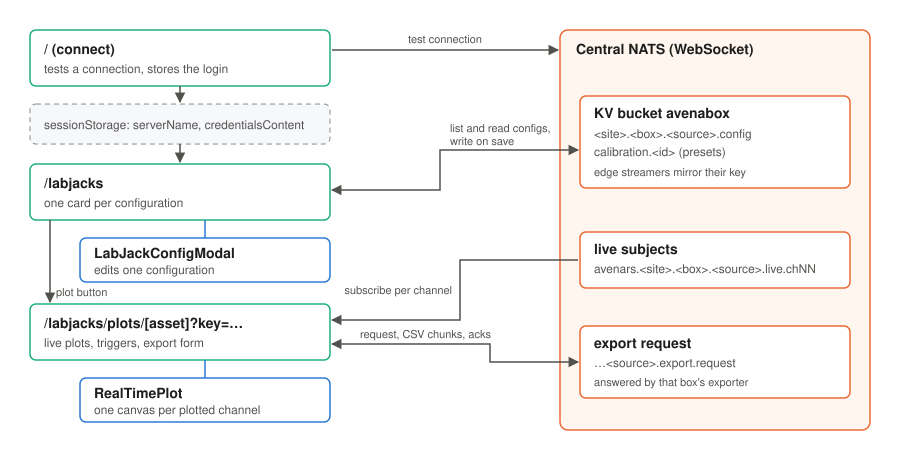

# How the webapp works

The webapp is three pages and two components. Every page talks to central
NATS directly from the browser; there is no application server in between.

## Connecting

The connect page (`/`) takes the central WebSocket address and a `.creds` file.
It opens a test connection, closes it, and stores the address and the file's
text in the tab's `sessionStorage` as `serverName` and `credentialsContent`.
Each later page reads those two values and opens its own connection. There is
no shared connection object between pages, so a page reload always starts
from a clean connection.

`connect()` in `src/lib/nats.svelte.ts` accepts a bare host name as well as a
full URL. It builds the `ws://` and `wss://` variants and tries them in order,
and resolves to `null` rather than throwing when none of them works, so the
pages show an error message instead of crashing.

## The LabJack list

`/labjacks` lists every key in the `avenabox` bucket that matches
`*.*.*.config` and shows one card per configuration. It also loads the
calibration presets stored under `calibration.*`.

Adding or editing a configuration opens `LabJackConfigModal`, which edits a copy
and returns it. The page writes the result to
`<site>.<box>.<source>.config`. From there the edge node's streamer picks the
change up within seconds (see [LabJack configuration](../reference/kv-config.md)).
Writes and deletes each open a short-lived connection of their own.

## Live plots

The plot page is `/labjacks/plots/<asset_number>?key=<kv key>`. The key names
the configuration to plot. Asset numbers are not unique across boxes, so the
key is what makes the page unambiguous; without it, the page takes the first
configuration with that asset number.

For each enabled channel the page subscribes to the channel's live subject
with a plain NATS subscription. Messages arrive as FlatBuffer `Scan`s (see
[Data formats](../reference/data-formats.md#live-messages)). The page keeps only
the newest undecoded message per channel. Every 100 ms a timer decodes it for
the channels being plotted (at most two at a time), applies the channel's
calibration, and appends the samples to a rolling buffer sized for the time
window. Keeping only the newest message means the plot never falls behind,
however slowly the browser draws, at the cost of skipping messages when a
channel sends more than ten a second.

Decoding has one quirk worth knowing. The browser can hand over a message as a
slice of a larger buffer that does not start on an 8-byte boundary, and the
generated FlatBuffers code cannot create a `Float64Array` view on it.
`FlatBufferParser` tries the fast view first and falls back to reading the
values one by one.

Each channel runs in one of three modes. **Free Run** plots continuously.
**Trigger Normal** and **Trigger Single** watch for the calibrated value to cross
a level, then freeze a window around the crossing so a single event can be
inspected. Normal re-arms once the post-trigger window has passed; Single keeps
its first capture until you press Re-arm.
Drawing is done by `RealTimePlot` (see [Components](components.md)).

## Exports

The export form on the plot page builds an export request and hands it to
`downloadExportViaNats()` in `src/lib/exporter.ts`, which implements the client
side of the [export protocol](../reference/export-protocol.md). It publishes the
request with a reply inbox and an ack subject, acknowledges every chunk as it
arrives, collects the chunks, and when the `complete` frame arrives turns them
into a file download. If no message arrives for ten minutes, it gives up.

## Current limitations

These are known and worth fixing, but none of them affects recorded data:

- **Plots skip messages at high rates.** A channel sending more than ten
  messages a second is not plotted in full: 2 kHz with 100 scans per read sends
  twenty a second, so about half of them reach the plot. The archive and
  exports have every sample.
- **Exports are held in memory.** A very large export is built up in the
  browser before it is saved. Split long ranges into several downloads.
- **An offline box is slow to report.** A request to a box that is offline
  gets no reply at all, so the export waits for the ten-minute timeout before
  failing.
- **Retrying and reloading open extra connections.** Close and reopen the tab
  if a page has been retried many times.
- **The credentials sit in `sessionStorage` as plain text** for as long as the
  tab is open. Log out or close the tab on shared machines.
