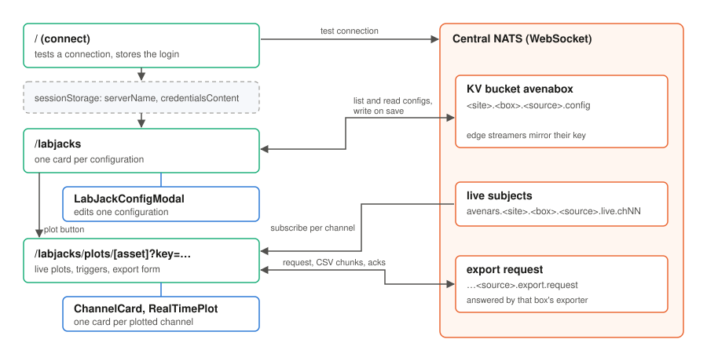

# How the webapp works

The webapp is three pages, an error page and six components. Every page talks
to central NATS directly from the browser; there is no application server in
between.

## Connecting

The connect page (`/`) takes the central WebSocket address and a `.creds` file.
It opens a test connection, closes it, and stores the address and the file's
text in the tab's `sessionStorage` as `serverName` and `credentialsContent`.
Each later page reads those two values and opens its own connection. There is
no shared connection object between pages, so a page reload always starts
from a clean connection. A page closes its connection before it retries and
when you leave it, so retrying does not pile up connections.

The credentials file is read when you press Connect, not when you pick it, so a
file chosen while the page is still loading is not lost. Pressing Enter or
clicking Connect again while a test connection is running does nothing.

`connect()` in `src/lib/nats.svelte.ts` accepts a bare host name as well as a
full URL. It builds the `ws://` and `wss://` variants and tries them in order,
and resolves to `null` rather than throwing when none of them works, so the
pages show an error message instead of crashing.

## The LabJack list

`/labjacks` lists every key in the `avenabox` bucket that matches
`*.*.*.config` and shows one card per configuration. Configurations are read
through `normalizeLabJackConfig()` in `src/lib/labjack-config.ts`, which fills
in missing fields and accepts older field names.

If you have not logged in, the page shows only an error with a link to the
connect page. Adding a configuration is disabled until the page is connected.
The Enabled or Disabled badge on a card is the configuration's
`labjack_on_off` setting. It says whether the box has been told to stream, not
whether the box is actually running.

Adding or editing a configuration opens `LabJackConfigModal`, which edits a copy
and returns it. The page writes the result to
`<site>.<box>.<source>.config`. From there the edge node's streamer picks the
change up within seconds (see [LabJack configuration](../reference/kv-config.md)).
Writes and deletes each open a short-lived connection of their own. Closing the
form with unsaved changes asks first. Delete sits at the bottom of each card,
away from Edit, and asks for confirmation.

Earlier versions also kept named calibration presets under `calibration.*` in
the same bucket. The webapp no longer reads or writes those keys, and the edge
node never did: each channel's calibration lives only in its configuration.

## Live plots

The plot page is `/labjacks/plots/<asset_number>?key=<kv key>`. The key names
the configuration to plot. Asset numbers are not unique across boxes, so the
key is what makes the page unambiguous. The page reads that one key, and only
if it is missing or belongs to another asset number does it list every
`*.*.*.config` key and take the first configuration with that asset number.

You choose up to two channels to plot, and the page subscribes to the live
subjects of those channels only, with plain NATS subscriptions. Subscriptions
follow the selection: deselecting a channel unsubscribes it and drops what it
had, and selecting it again starts an empty plot that fills from that moment.
Messages arrive as FlatBuffer `Scan`s (see [Data
formats](../reference/data-formats.md#live-messages)). Every message is queued
in arrival order until the page next gets to it. The queue is bounded at 5,000
messages per channel; it only fills if the page cannot keep up for a long
time. Then the oldest messages are dropped, the count shows under Data
Statistics, and the plot shows a gap where they were.

Decoding runs on the browser's animation frames. Each frame the channels take
turns, 50 messages at a time, for up to 8 ms; every channel gets at least one
turn, and whatever does not fit stays queued, in order, for the next frame. The
decoded buffers are copied into the page's state, and so redrawn, at most
about 30 times a second. A browser runs no animation frames in a background
tab, so there a 1 s timer does the decoding instead, and the plot catches up
when you come back.

Each sample gets its time from the `Scan` (first sample time plus its index
times the interval), and the channel's calibration is applied. Missing samples,
and missing time between messages, become gaps in the line rather than being
joined across; repeated or late messages are skipped; and if the timeline jumps
backward (a clock step or a new sampling run) the buffer starts again. The code
for all of this is in `src/lib/plot/`, with unit tests.

The page keeps one state object per channel (`ChannelView` in
`src/lib/plot/channel-view.svelte.ts`): its mode, axis and trigger settings, the
trigger capture, the live buffer and the snapshot the plot draws. The layout is
split into components: `ChannelCard` (header badges, Mode & Axis, Trigger
Settings and the plot), `StatsPanel` (Data Statistics), `ExportDialog` and
`ConnectionBanner`. The page itself loads the configuration, owns the NATS
connection, the subscriptions and the decode loop, and runs exports.

Decoding has one quirk worth knowing. The browser can hand over a message as a
slice of a larger buffer that does not start on an 8-byte boundary, and the
generated FlatBuffers code cannot create a `Float64Array` view on it.
`FlatBufferParser` copies such a slice to a fresh buffer and reads the values
one at a time, so a missing value comes through as a gap.

### Units and calibration

Each channel's calibration carries the unit it converts to, for example
`{"type":"linear","a":2.0,"b":-1.0,"unit":"kPa"}`. The unit is worked out by
`resolveCalibrationUnit()` in `src/lib/calibration.ts` and used for the axis
title, Latest, the y limits and the trigger threshold. Each channel header
shows a tag saying what the plotted values are:

- `raw volts` when the channel has no calibration (identity). The values are
  volts; a configuration from before calibrations had units that still names
  another unit for the channel gets a warning.
- `calibrated → <unit>` when it has one. The values are in the calibration's
  unit.

A configuration saved before calibrations had units has no `unit` in the
calibration. The page then uses the channel's `measurement_units` entry, unless
it is V, which was the value filled in when nobody chose a unit. Such a
channel shows `calibrated: <type> → unit not set` in yellow with a line asking
you to set the unit in the configuration; saving the configuration from the
form fixes it for good.

A calibrated plot also shows a Raw badge with the latest reading in volts
before calibration, which is handy for checking a sensor against its data
sheet.

### Noise filters

A channel with `filters` in its configuration (see
[LabJack configuration](../reference/kv-config.md#filters)) is filtered on the
way into its buffer by `src/lib/plot/live-filter.ts`: spikes and the 10 Hz and
11.9 Hz square waves are removed from the raw volts, the calibration is applied,
then the causal high-pass and low-pass filters run. Each point keeps both
values; a Filtered / Raw switch on the channel card chooses which one is drawn
and triggered on, without saving anything, and the plot shows a FILTERED badge
while filtered values are drawn. The despike window holds back the newest
`ceil(2.5 ms × rate) − 1` samples (2 ms at 2 kHz), so the trace ends that much
before the newest sample; every sample is still drawn once, in order. The
filters add about 0.3 µs of work per sample. Filters that cannot run at the
channel's rate are named under the card's header.

### Status and connection

The connection badge under Data Statistics follows the NATS connection's own
status: Connecting, Connected, Reconnecting or Disconnected. While the client
is reconnecting, a yellow banner says so; the plots carry on by themselves once
it is back, and the missing time shows as a gap. If the connection closes for
good, a red banner gives the reason and a Reconnect button.

When the page cannot load at all, the error message comes with the button that
can help: Retry for a failed connection or a missing configuration, and Log in
when there are no saved credentials. An asset number in the address that is not
a number gets the app's "not found" page, with a link back to the LabJack list.
Back returns to the LabJack list.

### Modes and axes

Each channel runs in one of three modes. **Free Run** plots continuously.
**Trigger Normal** and **Trigger Single** watch for the calibrated value to cross
a level, then freeze a window around the crossing so a single event can be
inspected. Normal re-arms once the post-trigger window has passed; Single keeps
its first capture until you press Re-arm. The capture is drawn inside the plot
area with the time axis titled "Time from trigger".

Turning Auto Y-Scale off keeps the plot where it is: Y Min and Y Max start at
the range the plot was showing, rounded to a few significant digits, instead of
-1 and 1.

In a trigger mode the trigger level is drawn as a dashed line and labelled once,
as "Trig level", in the margin above the plot. The time axis aims for about one
tick per 70 pixels; on a narrow screen it places them closer, as long as the
labels do not overlap, so a phone still shows several ticks rather than only the
two ends.

The Y limits, X window and trigger level accept any valid number, zero
included. An invalid axis value (Y Min not below Y Max, an X window of 0, text
that is not a number) is put back to the previous value and a short message
under the inputs says why. An invalid trigger level, or a post-trigger window
under 0.01 s, is put back without a message. Drawing is done by `RealTimePlot` (see [Components](components.md)).

## Exports

The export dialog on the plot page opens with the plotted channels ticked and
the last two minutes filled in. Times are to the second, in the browser's time
zone, which the dialog names; under the times it shows the same range in UTC,
which is what the request carries. It builds an export request and hands it to
`downloadExportViaNats()` in `src/lib/exporter.ts`, which implements the client
side of the [export protocol](../reference/export-protocol.md). It publishes the
request with a reply inbox and an ack subject, acknowledges every chunk as it
arrives, and finishes when the `complete` frame arrives. If no exporter is
listening (the box is offline), the NATS server says so straight away and the
export fails with "No exporter is listening on …". If no message arrives for
ten minutes, it gives up.

When any channel has filters in the configuration, the dialog offers "Include
filtered values", ticked to begin with. Ticked, the request carries the
configuration's `filters`, and when an exported channel has any, the CSV gets a
`filtered_value` column, computed on the box with zero-phase filters (see
[Filtered values](../reference/export-protocol.md#filtered-values)). Raw and
calibrated values are exported either way.

Each export runs on a NATS connection of its own, opened with the saved
credentials when you press Start Download and closed when the export completes,
fails or is cancelled. Reloading the configuration, Retry, Reconnect or a lost
live connection therefore do not cut a running export, and the dialog stays
open through them. Leaving the page cancels the export.

Where the browser has a save dialog (Chrome, Edge and other Chromium browsers),
Start Download first asks where to save the file, offering the LabJack's name
(or the exporter's default name), and then writes each chunk to that file as it
arrives, before acknowledging it: the page passes the file write as the `onChunk`
hook of `downloadExportViaNats`, which awaits it before each ack and keeps no
other copy of the export, so a slow disk slows the exporter down instead of
filling memory. Closing the save dialog without choosing a file starts no export.
Firefox and Safari have no such dialog; there the chunks are collected (folded
into Blob parts every 8 MiB) and saved as a normal download when the export
completes.

Cancel Download stops a running export: the page stops reading and
acknowledging chunks, releases the reply subscription, closes the export's
connection and saves nothing. A partly written file is discarded; if you chose
to replace an existing file, that file is left as it was. The
webapp also sends a `cancel` message on the export's ack subject, and the edge
exporter stops before its next chunk. An older exporter that doesn't know the
message stops when its acknowledgements time out, after up to eight more chunks
and about 30 s.

## Current limitations

These are known and worth fixing, but none of them affects recorded data:

- **A plot can show gaps after a long stall.** If the page falls more than
  5,000 messages behind on a channel, the oldest are dropped and counted, and
  the plot shows a gap. A channel that is not selected is not received at all,
  so selecting it again starts an empty plot. The archive and exports have
  every sample.
- **Firefox and Safari keep the whole export until it finishes.** Without a
  save dialog, the chunks are folded into Blob parts every 8 MiB and kept in
  the browser's Blob storage until the export completes, then saved. Little
  sits in JavaScript memory, but split very long ranges into several downloads
  there.
- **The credentials sit in `sessionStorage` as plain text** for as long as the
  tab is open. Log out or close the tab on shared machines.
